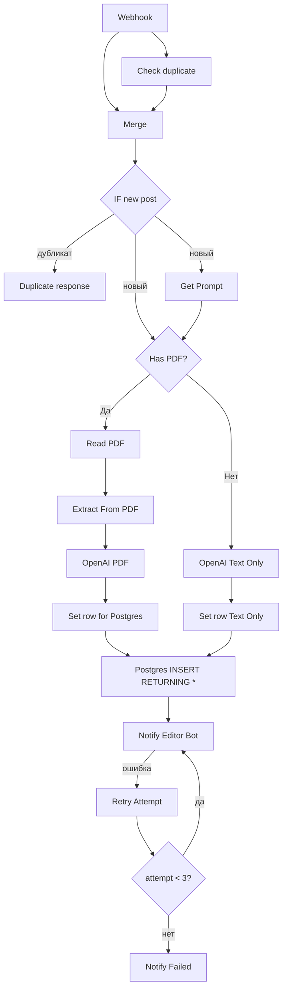

# n8n Workflows

## pdf_processing.json

Импортируйте этот workflow в n8n (Workflows → Import from File).

Поддерживаются посты: **только PDF**, **только текст**, **PDF + текст**. Пустые посты в webhook не приходят (фильтр в userbot).

### Схема workflow

1. **Webhook** — принимает POST от userbot (JSON: post_text, pdf_path, message_id, source_channel; pdf_path может быть пустым).
2. **Ранняя идемпотентность:** **Check duplicate** (Postgres: `SELECT EXISTS(...)` по `source_channel` + `source_message_id` и статусу `processing`/`pending_review`) → **Merge** (объединение с данными Webhook) → **IF new post** (`is_duplicate = false`). Ветка «дубликат» → **Duplicate response** (Set: `{ ok: true, skipped: "duplicate" }`) — ответ webhook 200 с этим телом. Ветка «новый пост» → Get Prompt и Has PDF (текущая обработка).
3. **Has PDF** — условие: pdf_path не пустой. True → ветка с PDF, False → ветка «только текст».
4. **Ветка с PDF:** Read PDF → Extract From PDF → OpenAI (саммари по тексту из PDF) → Set row for Postgres.
5. **Ветка только текст:** OpenAI (саммари по post_text) → Set row Text Only (pdf_path и extracted_text пустые).
6. **Postgres INSERT RETURNING *** — одна нода для обеих веток; возвращает полную строку.
7. **Notify Editor Bot** — POST на editor-bot с post_id, summary, pdf_path (может быть пустым) и заголовком Authorization.

### Настройка после импорта

1. **Webhook**  
   После активации workflow скопируйте URL (например `https://n8n.neurascope.pro/webhook/pdf-post`) и укажите в `.env` как `N8N_WEBHOOK_URL`.

2. **Read PDF**  
   Путь к PDF приходит в теле запроса. В Docker — `/data/pdfs/xxx.pdf`.

3. **OpenAI**  
   Создайте credential OpenAI API и привяжите к ноде. Промпт можно менять в ноде.

4. **Set row (PDF / Text Only)**  
   В выражениях для полей `original_text`, `extracted_text`, `summary` используется удаление null-байтов (`.replace(/\x00/g, '')`).

5. **Postgres INSERT RETURNING ***  
   Credential к БД (host: postgres, port: 5432, database/user/password из .env). В запросе: экранирование строк и **ON CONFLICT (source_channel, source_message_id) DO UPDATE** — при повторе запись обновляется.

6. **Notify Editor Bot**  
   URL `http://editor-bot:8080/incoming/post`, заголовок `Authorization: Bearer $env.EDITOR_BOT_WEBHOOK_TOKEN`. Editor-bot отправляет пост **всем редакторам** из БД (список в админке → Редакторы); при отсутствии редакторов возвращает 503.  
   Для устойчивости к таймаутам и обрывам в ноде заданы: **Timeout** 300000 ms (300 s) в `parameters.options.timeout`; в настройках ноды (Settings): **Retry on Fail** включён, **Max Tries** 2 (итого до 3 попыток), **Wait Between Tries (ms)** 10000 (10 s). По документации n8n таймаут и пауза между повторами указываются в миллисекундах. При известном баге n8n (retry после успеха) рекомендуется включить в ноде опцию **Response → Include Response Headers and Status**.  
   **Ветвление по ошибке (On Error):** у ноды включён **On Error → Continue (using error output)**. При ошибке (таймаут, 5xx и т.д.) выполнение идёт во второй выход: **Retry Attempt** (Set, поле `attempt = ($json.attempt ?? 0) + 1`) → **IF Retry** (условие `attempt < 3`). Если истина — возврат в **Notify Editor Bot** (повторная попытка); если ложно — **Notify Failed** (No Op), ветка завершается.

### Тело POST от userbot

- `post_text` — текст поста
- `pdf_path` — путь к файлу (например `/data/pdfs/123_456.pdf`)
- `message_id` — ID сообщения
- `channel_id` — ID канала
- `source_channel` — идентификатор канала-источника

### Надёжность данных

- **Null-байты:** в нодах Set row для текстовых полей применяется `.replace(/\x00/g, '')`, в Postgres-запросе — полное экранирование строк.
- **Повторы:** при повторной отправке того же поста (тот же source_channel + source_message_id) срабатывает ON CONFLICT DO UPDATE, ошибка duplicate key не возникает.

### Опционально: ранняя идемпотентность

При ретраях userbot один и тот же пост может несколько раз попадать в webhook. Чтобы не выполнять PDF/OpenAI/Notify повторно, в начале workflow можно добавить: нода **Check duplicate** (Postgres: `SELECT` по `source_channel` + `source_message_id` и статусу `processing`/`pending_review`) → **IF new post** → ветка «уже обработан»: ответ webhook 200 с телом `{ "ok": true, "skipped": "duplicate" }`; ветка «новый пост»: текущая цепочка Has PDF → … → Notify Editor Bot.
