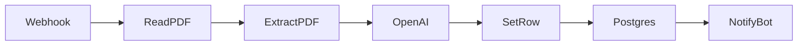

# n8n Workflows

## pdf_processing.json

Импортируйте этот workflow в n8n (Workflows → Import from File).

### Схема workflow

1. **Webhook** — принимает POST от userbot (JSON с post_text, pdf_path, message_id, source_channel).
2. **Read PDF** — читает файл по пути из тела запроса (`/data/pdfs/...` в Docker).
3. **Extract From PDF** — извлекает текст.
4. **OpenAI** — генерирует саммари по промпту.
5. **Set row for Postgres** — собирает все поля в один объект для вставки.
6. **Postgres INSERT RETURNING id** — выполняет INSERT и возвращает `id`.
7. **Notify Editor Bot** — POST на editor-bot с post_id, summary, pdf_path и заголовком Authorization.

### Настройка после импорта

1. **Webhook**  
   После активации workflow скопируйте URL (например `https://n8n.neurascope.pro/webhook/pdf-post`) и укажите в `.env` как `N8N_WEBHOOK_URL`.

2. **Read PDF**  
   Путь к PDF приходит в теле запроса. В Docker — `/data/pdfs/xxx.pdf`.

3. **OpenAI**  
   Создайте credential OpenAI API и привяжите к ноде. Промпт можно менять в ноде.

4. **Postgres INSERT RETURNING id**  
   Credential к БД (host: postgres, port: 5432, database/user/password из .env). Запрос уже настроен на INSERT с RETURNING id.

5. **Notify Editor Bot**  
   URL `http://editor-bot:8080/incoming/post`. Задайте в n8n переменную окружения `EDITOR_BOT_WEBHOOK_TOKEN` и тот же токен в `.env` как `EDITOR_BOT_WEBHOOK_TOKEN` — тогда editor-bot будет принимать только запросы с заголовком `Authorization: Bearer <token>`.

### Тело POST от userbot

- `post_text` — текст поста
- `pdf_path` — путь к файлу (например `/data/pdfs/123_456.pdf`)
- `message_id` — ID сообщения
- `channel_id` — ID канала
- `source_channel` — идентификатор канала-источника
